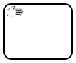
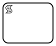
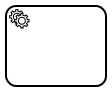
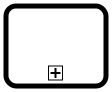
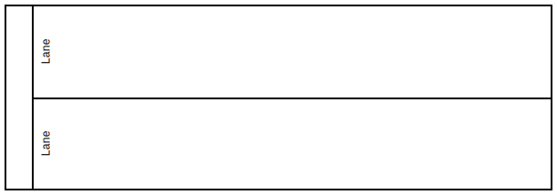
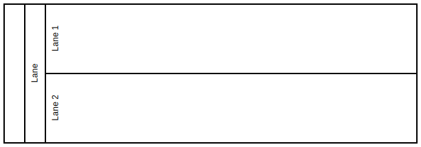

# Unterstütze BPMN-Elemente

## Activities

### UserTask


Stellt eine Aufgabe dar, die von Benutzern abgearbeitet werden kann. Der Benutzer kann Eingaben machen.

### ManualTask



Stellt eine Aufgabe dar, die der Benutzer manuell erledigen und 
dann den Task bestätigen muss.

### Empty-Activity


Der Prozess halt bei der Ausführung an dem Task an.
Es wird gewartet bis der Benutzer die Ausführung weiterführt.

### SendTask


Sendet eine vorher definierte Message an die ProcessEngine.

### ReceiveTask


Empfängt eine Message.

### ScriptTask



Führt JavaScript aus.

### ServiceTask



Zur Benutzung von der ProcessEngine bereitgestellten Services.
Aktuell HTTP Tasks und ExternalTasks.

### CallActivity



Führt ein anderes auf der ProcessEngine befindliches Prozessmodell aus.

### SubProcess


Ein SubProcess.

## Participants/Lanes

### Pool


Ein Pool definiert den auszuführenden Prozess.
Ein Diagramm kann mehrere Pools enthalten und Pools können mehrere Lanes enthalten.

### Lanes



Lanes dienen zur Organisation und Veranschaulichung verschiedener Verantwortungsbereiche.

### Lanesets



Lanes können weitere Lanes in sich Tragen.
Die Parentlane wird dann Laneset genannt.

## Artifacts

### TextAnnotation


Die TextAnnotation kann benutzt werden um an Elementen/Activites eine erwartete Laufzeit zu definieren.

Beispiel:

````text
RT: 00:01:45
````

## Gateways

### Exclusive Gateway


Der Prozessfluss wird in Abhängigkeit einer vorher an Sequenzflows definierten Bedingung geleitet. Es können mehrere Pfade verbunden werden.

### Parallel Gateway


Hängt nicht von einer Bedingung ab, sondern leitet den Prozessfluss an alle ausgehende Pfade.

## Events

### StartEvents


Der Prozess wird optional mit einem initiellen Token über ein normales StartEvent gestartet.

#### MessageStartEvent


Der Prozess wird anhand einer Message gestartet.

#### SignalStartEvent


Der Prozess wird anhand eines Signals gestartet.

#### TimeStartEvent


Der Prozess wird anhand eines Timers im Cronjob format gestartet.

### IntermediateEvents


#### IntermediateLinkCatchEvent


Wenn der Link gecatcht wird, wird der Prozessfluss an den ausgehenden Pfaden des Events weitergeführt.

#### IntermediateLinkThrowEvent


Es wird ein Link mit einem vorher definierten Linkname geworfen.

#### IntermediateTimerEvent


Es kann ein Datum oder eine Dauer/Duration gesetzt werden, an dem die Ausführung des Prozesses fortgeführt wird.

#### SignalIntermediateCatchEvent


#### SignalIntermediateThrowEvent


#### MessageIntermediateCatchEvent


#### MessageIntermediateThrowEvent


### BoundaryEvents

#### ErrorBoundaryEvent


#### NonInterruptingMessageBoundaryEvent


#### NonInterruptingSignalBoundaryEvent


#### NonInterruptingTimerBoundaryEvent


### EndEvents


Der Prozess wird bei erreichen des Events beendet.

#### ErrorEndEvent


#### SignalEndEvent


#### MessageEndEvent


#### TerminateEndEvent


#### EscalationEndEvent


